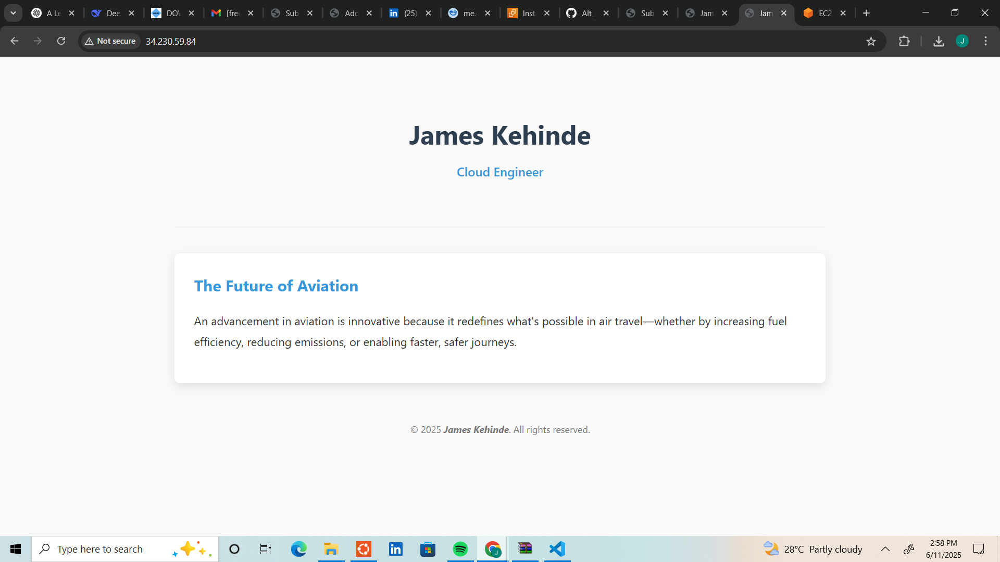
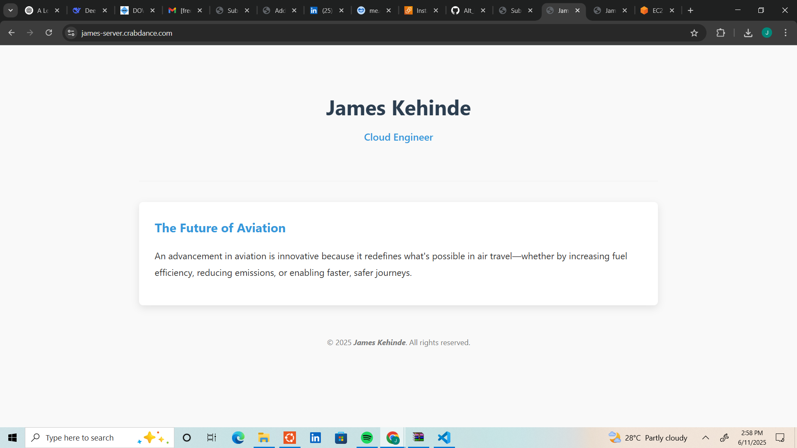

# This step-by-step guide will help you host a website on an **AWS EC2** instance and configure **HTTP (port 80)** and **HTTPS (port 443)** for secure browsing.  

---

## Prerequisites  
To begin, I ensured to have the following all set up  
✅ An AWS account (Free Tier eligible).
✅ A domain name (got a free subdomain from freedns.afraid.org).

---

## Step 1: Launch an EC2 Instance 
- Name the instance
- Choose Amazon Machine Image (AMI).
- Select Instance Type, t2.micro (Free Tier eligible).
- Create a Key Pair (for SSH Access) and download the .pem file.
- Configure Security Group (Firewall Rules), SSH (Port 22) – For remote access, HTTP (Port 80) – For website traffic, HTTPS (Port 443) – For secure traffic
- Launch the Instance

## Step 2: Connect to Your EC2 Instance
- Find Your Instance’s Public IP
- Connect via SSH
- Install a Web Server (Nginx)
```bash
sudo apt update && sudo apt upgrade -y
sudo apt install nginx -y
sudo systemctl start nginx
sudo systemctl enable nginx
```
- Verify Installation: Copy EC2 public IP into the browser, and the Nginx welcome page pops up.


## Step 3: Configure a Domain  

### Point Domain to EC2 Public IP  
- In your **domain registrar’s DNS settings**, add an **A record**:  

  - Type: A  
  - Name: @ (or www)  
  - Value: Your-EC2-Public-IP  
  - TTL: Auto  

- Wait **5-10 mins** for DNS propagation.  


# Step 4: Secure Your Site with HTTPS (Free SSL via Let’s Encrypt)  

### 1. Install Certbot  
```bash
sudo apt install certbot python3-certbot-nginx -y
```

### 2. Get an SSL Certificate  
- Be sure your domain correctly points to your EC2 IP before running Certbot.

```bash
sudo certbot --nginx -d james-server.crabdance.com -d www.james-server.crabdance.com
```
- Follow prompts (enter email, agree to terms).   

---

# Step 5: Push your website and related files to GitHub and clone your GitHub repo

# Step 6: Verify Website  
Visit:  
  - [Subdomain](https://james-server.crabdance.com/) (redirects to HTTPS)
  - [Public IP](http://34.230.59.84) (redirects to HTTP)

    
## Live Site


